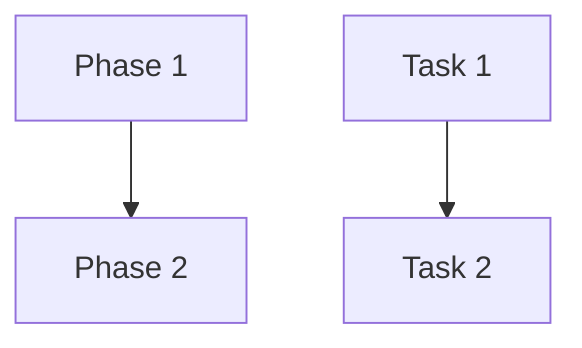

# Agent Planning Skill

This skill provides a structured workflow for analyzing user requests and breaking them down into a comprehensive, verifiable plan before any implementation begins.

## When to Use

- When a user request is complex, multi-faceted, or ambiguous.
- BEFORE creating tickets in a project management tool or any other tracking system.
- When you need to ensure the user agrees with the proposed technical approach.
- When breaking down large features into parallelizable subtasks.

## Instructions

### 1. Intent Analysis

- Restate the user's core goal in a single sentence.
- Identify "what" needs to be done vs "how" it will be implemented.
- Perform an "XY Problem" check: Is the user's request a sub-optimal path to a deeper goal?
- Clarify any ambiguities with the user before proceeding.

### 2. Solution Exploration

- Brainstorm at least 3-5 different technical approaches.
- Evaluate each approach based on:
  - **Feasibility**: Can it be done with existing tools/code?
  - **Complexity**: How hard is it to implement and maintain?
  - **Performance**: Does it meet efficiency requirements?
  - **Verifiability**: How easily can it be tested?
  - **Parallelizability**: Can subtasks be executed in parallel?
- Recommend the best approach and justify the choice.
- Present the analysis to the user for feedback if needed.

### 3. Plan Creation

Create a new markdown file in `.cursor/plans/` using a slugified name (e.g., `.cursor/plans/2026-01-29-implement-feature-x.md`).

The plan **MUST** include:

- **Context**: Architectural decisions, constraints, requirements, related systems/components, high-level goals and rationale. This section provides the "why" and "what constraints exist" that will be inherited by all subtasks.
- **Development Philosophy**: High-level guiding principles for the implementation (e.g., Readability over Migration, No Lint Disables, Verifiable Changes).
- **Summary**: High-level overview of what will be accomplished.
- **Phases**: Group tasks into logical milestones (e.g., Discovery, Implementation, Verification).
- **Atomic Tasks**: Breakdown each phase into fine-grained, mutually exclusive tasks.
  - Each task should be independent where possible to enable parallel execution.
  - Tasks should have clear boundaries (no overlapping work).
  - Tasks should be small enough for a single agent to complete efficiently.
- **Acceptance Criteria**: For each task, define what "Done" looks like.
- **Test Plan**: How each task will be verified (commands, expected output, test cases).
- **Dependencies**: Document which tasks depend on others (if any).
- **Related Context**: Links to ADRs, documentation, related work, or external references.

#### Plan File Template

````markdown
# Plan: [Feature Name]

## Context

### Goals

[What we're trying to achieve - the "why" behind this work]

### Architectural Decisions

[Key technical choices and rationale - what approach we're taking and why]

### Constraints

[Limitations, requirements, dependencies - what we must work within]

### Related Systems

[Components this work affects or depends on - integration points]

## Development Philosophy

- **Readability over Migration**: Prioritize clean, readable code over maintaining legacy interfaces if they hinder the design.
- **No Lint Disables**: Ban `eslint-disable` or similar comments; fix the root cause instead.
- **Verifiable Changes**: Every task must end with a passing test or a dev-command verification.

## Summary

[One paragraph describing the overall goal]

## Dependency Graph



## Phases

### Phase 1: [Phase Name]

- **Objective**: [What this phase accomplishes]
- **Context Inheritance**: [Note how this phase relates to the overall Context]

#### Tasks

1. **[Task Name]**
   - **Acceptance Criteria**: [What "done" means]
   - **Test Plan**: [How to verify]
   - **Dependencies**: [None or list of prerequisite tasks]

2. **[Task Name]**
   - ...

### Phase 2: [Phase Name]

...

## Related Context

- ADR #[number]: [Link to relevant architecture decision]
- Documentation: [Links to relevant docs]
- Related Work: [Links to related features or tasks]
````

### 4. User Verification

- Present the plan to the user.
- **DO NOT** proceed to ticket creation or implementation until the user has explicitly approved the plan or the plan file is finalized.
- If the user requests changes, update the plan file and re-present for approval.

### 5. Handoff

- Once the plan is verified, the planning phase is complete.
- Syncing this plan to external tracking systems (e.g., Vibe Kanban, Jira, GitHub Issues) is the responsibility of the calling agent (the "Orchestrator") using their specialized management skills.

## Best Practices

- **Atomic Tasks**: Break work into the smallest meaningful units that can be verified independently.
- **Mutually Exclusive**: Ensure tasks don't overlap to prevent conflicts during parallel execution.
- **Clear Criteria**: Each task should have unambiguous acceptance criteria.
- **Testable**: Every task should have a clear test plan.
- **Parallelizable**: Design tasks to maximize opportunities for parallel execution.

## References

- Use `.cursor/rules/development_workflow.mdc` for lifecycle alignment.
- Refer to Orchestrator agent definitions (e.g., `.cursor/agents/vibe-orchestrator.md`) for how this skill integrates with specific project management workflows.
