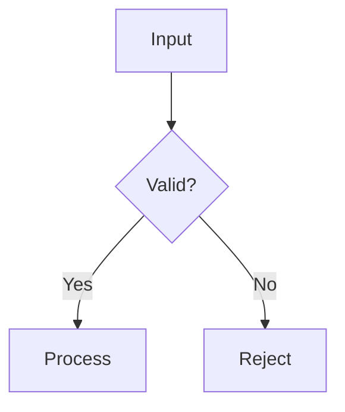
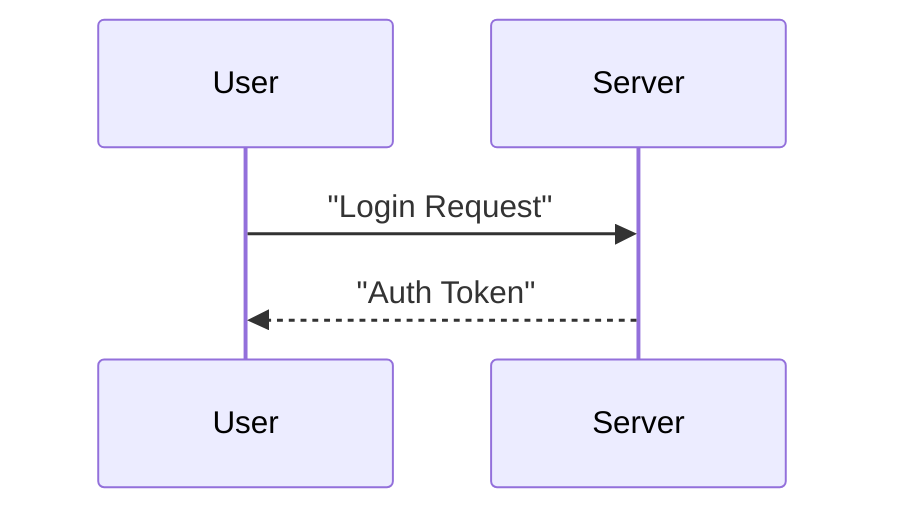

# Draw Diagrams with Mermaid

## Purpose

This skill allows the agent to generate diagrams (PNG, SVG, PDF) from Mermaid text syntax. It follows a robust workflow involving markdown files and verification.

## 1. Safety & Verification

Before executing any commands, the agent must:

1. **Check Tool**: Verify `mmdc` is installed by running `mmdc --version`.
2. **Verify Syntax**: All node labels **MUST** be double-quoted (e.g., `A["Start"]`).
3. **Reference Examples**: Consult `.cursor/skills/draw-diagrams-with-mermaid/references/mermaid-syntax.md` for compliant examples.

## 2. Common Workflows

### Workflow: Generate Diagram from Markdown (Primary)

The standard way to generate a diagram is to first create a markdown file containing the Mermaid block and then render it.

1. **Create Markdown File**: Write the Mermaid code into a `.md` file.
   - **Crucial Rule**: Use double quotes for all node labels.
   - **Crucial Rule**: The file **MUST ONLY** contain the Mermaid code block (no titles, extra text, etc.).
2. **Render Diagram**: Run the helper script to generate the image.

   ```bash
   .cursor/skills/draw-diagrams-with-mermaid/scripts/draw-from-md.sh input.md [output.png]
   ```

   - Default output format is **PNG**.
   - You can specify other extensions (e.g., `output.svg`, `output.pdf`) to change the format.

3. **Verify & Fix**:
   - If the command fails (non-zero exit code), read the error message from the terminal.
   - Analyze the syntax error, fix the Mermaid code in the markdown file, and retry.
   - Repeat until the diagram is successfully generated.

## 3. Implementation Rules

1. **Double Quoting**: Every label in the diagram must be wrapped in double quotes.
   - Good: `A["Start"]`, `B{"Decision"}`
   - Bad: `A[Start]`, `B{Decision}`
2. **No Configuration Files**: Do not use the `assets/default-config.json` or any other external configuration file unless explicitly asked. Rely on standard `mmdc` defaults.
3. **Persistence**: Keep the markdown file as a source of truth for the diagram.
4. **Code Block Only**: The input markdown file must contain nothing but the Mermaid code block. Do not include headers, descriptions, or other Markdown elements.

## 4. Error Handling

- **`mmdc` failure**: Usually indicates a syntax error. Common issues:
  - Missing double quotes on labels.
  - Incorrect arrow syntax (e.g., using `->` instead of `-->` in flowcharts).
  - Unclosed braces or brackets.
- **Output file not found**: The `draw-from-md.sh` script handles renaming logic if `mmdc` adds suffixes like `-1.png`. If it still fails, check permissions.

## 5. Examples

### Example: Valid Flowchart (PNG)

1. **Write `logic.md`** (The file includes **only** this code block):



1. **Run Command**:

   ```bash
   .cursor/skills/draw-diagrams-with-mermaid/scripts/draw-from-md.sh logic.md
   ```

### Example: Valid Sequence Diagram (SVG)

1. **Write `auth.md`** (The file includes **only** this code block):



1. **Run Command**:

```bash
.cursor/skills/draw-diagrams-with-mermaid/scripts/draw-from-md.sh auth.md auth-flow.svg
```
