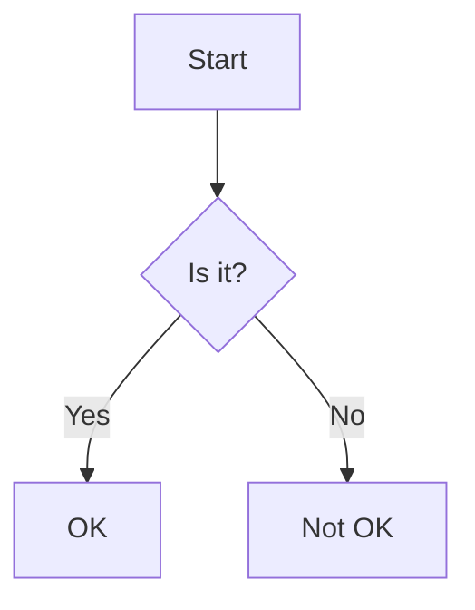
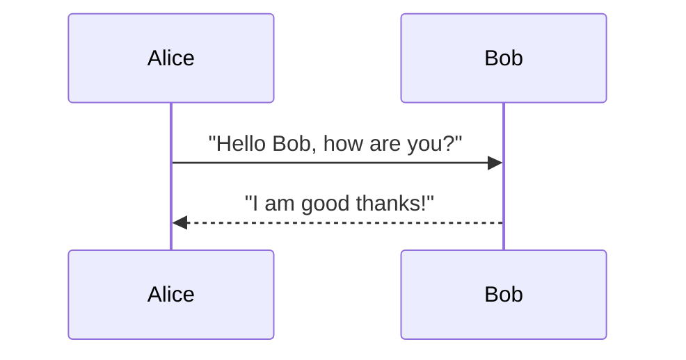
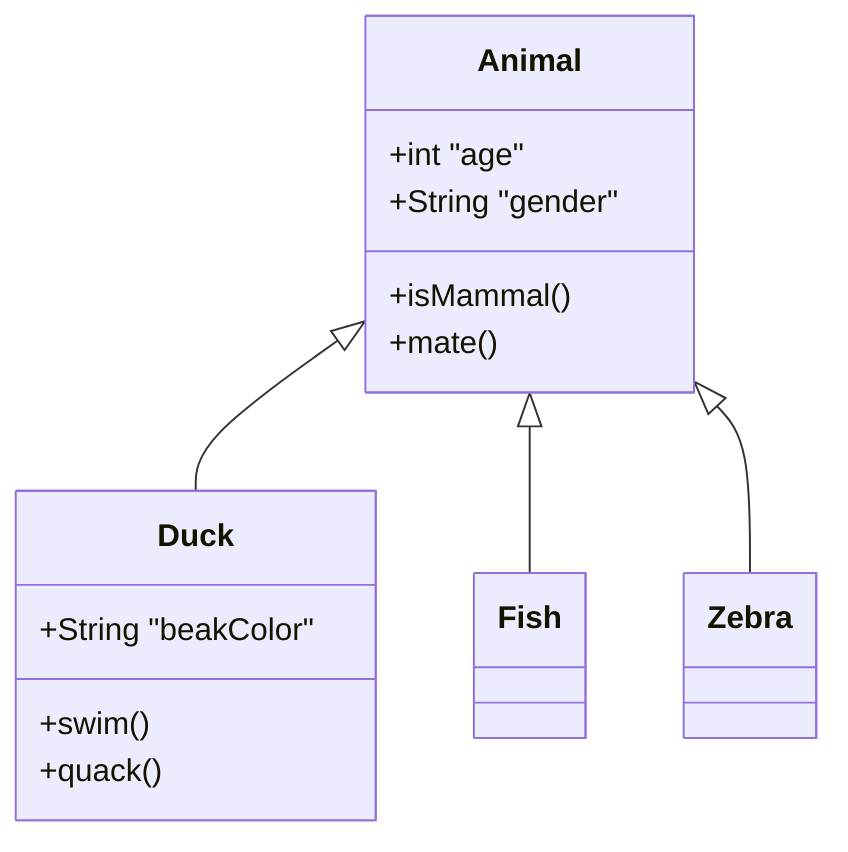
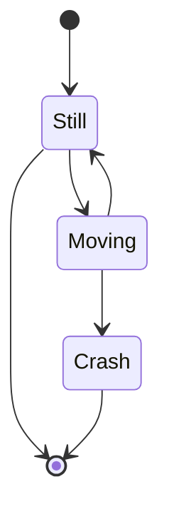
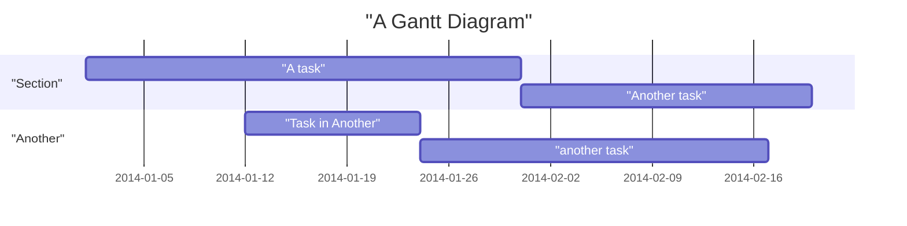
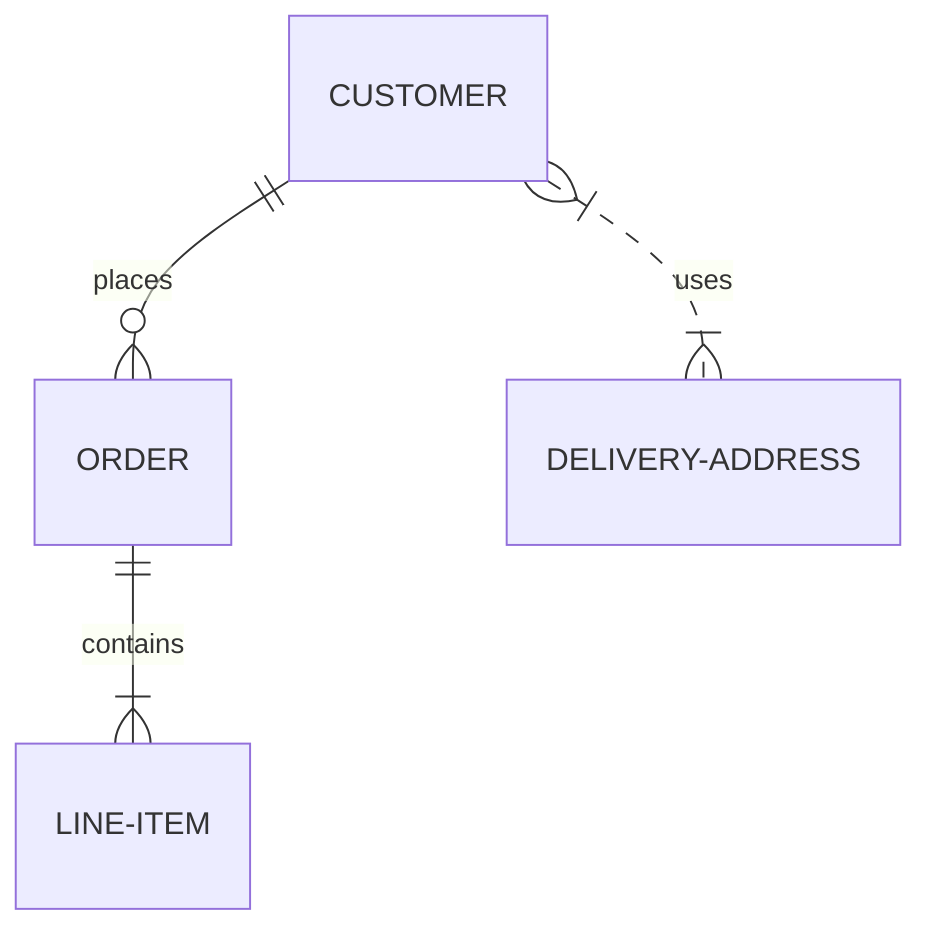

# Mermaid Syntax Examples

Basic examples of Mermaid syntax for different chart types. **All node labels must be double-quoted.**

## Flowchart

## Sequence Diagram

## Class Diagram

## State Diagram

## Gantt Chart

## Entity Relationship Diagram

## More documentation

Visit [Mermaid.js documentation](https://mermaid.js.org/) for more details.
