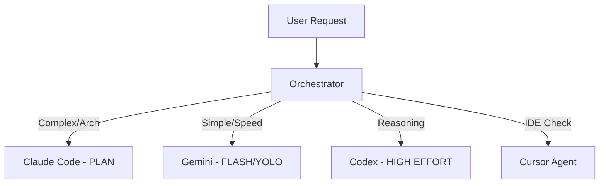

# Vibe Execution MCP Tools Reference

This document provides a comprehensive overview of the MCP tools available in the `vibe_kanban` server that are specifically relevant to task execution and implementation.

---

## 1. Task State & Context

### `get_task`

Retrieves detailed information about a specific task.

- **Required Arguments**:
  - `task_id` (UUID): The ID of the task to retrieve.
- **Purpose**: Fetch details like the task description, status, and associated metadata to aggregate context before implementation.

### `get_context`

Retrieves the current workspace context.

- **Requirements**: Only available within an active workspace session.
- **Required Arguments**: None.
- **Returns**: Project, task, and workspace metadata.
- **Purpose**: Efficiently discover the environment without redundant searches or `get_task` calls.

### `update_task`

Updates an existing task's title, description, or status.

- **Required Arguments**:
  - `task_id` (UUID): The ID of the task to update.
- **Optional Arguments**:
  - `title` (string, nullable): New title for the task.
  - `description` (string, nullable): New description for the task.
  - `status` (string, nullable): New status ('todo', 'inprogress', 'inreview', 'done', 'cancelled').
- **Purpose**: Primarily used by workers to set status to `inprogress` when starting, append execution logs to the description, and mark as `done` upon completion.

---

## 2. Session Management

### `start_workspace_session`

Starts working on a task by creating and launching a new workspace session.

- **Required Arguments**:
  - `task_id` (UUID): The ID of the task to start.
  - `executor` (string): The coding agent executor to run (e.g., 'CLAUDE_CODE', 'CURSOR_AGENT', etc.).
  - `repos` (array): List of repository configurations. Each item must contain:
    - `repo_id` (UUID)
    - `base_branch` (string)
- **Optional Arguments**:
  - `variant` (string, nullable): Optional executor variant (e.g., 'PLAN', 'YOLO', 'DANGEROUSLY_SKIP_PERMISSIONS'). Use variants to control agent behavior like planning mode or auto-approval.
- **Purpose**: Initializes the implementation environment for the assigned task.

---

## 3. Repository & Environment Management

### `get_repo`

Retrieves repository details including automation scripts.

- **Required Arguments**:
  - `repo_id` (UUID): The ID of the repository.
- **Purpose**: Inspect setup, cleanup, and dev server scripts.

### `update_setup_script` / `update_cleanup_script` / `update_dev_server_script`

Updates a repository's automation scripts.

- **Required Arguments**:
  - `repo_id` (UUID): The ID of the repository.
  - `script` (string): The new script content.
- **Purpose**: Dynamically adjust the environment if planning identifies missing dependencies or custom setup needs.

---

## 4. Supported Executors & Strategy

### 4.1. Supported Executors

| Executor ID    | Best For...                 | Key Variants / Parameters                 |
| -------------- | --------------------------- | ----------------------------------------- |
| `CLAUDE_CODE`  | Architecture, complex logic | `PLAN`, `dangerously_skip_permissions`    |
| `GEMINI`       | High speed, large context   | `FLASH`, `yolo: true`                     |
| `CURSOR_AGENT` | IDE-integrated edits        | `model`, `force: true`                    |
| `CODEX`        | Specialized reasoning       | `model_reasoning_effort: high`, `sandbox` |
| `AMP`          | Rapid iteration             | `dangerously_allow_all`                   |
| `DROID`        | High autonomy               | `autonomy: skip-permissions-unsafe`       |
| `OPENCODE`     | Open-source LLM focus       | `model`, `agent`                          |
| `QWEN_CODE`    | Multilingual/Qwen focus     | `yolo: true`                              |
| `COPILOT`      | GitHub Copilot integration  | `model`                                   |

### 4.2. Strategic Selection Guide

Choose the right executor based on the task phase and complexity to maximize efficiency and minimize human intervention:

- **Phase: Discovery & Planning**: Use `CLAUDE_CODE` with `variant: 'PLAN'` for deep analysis and architectural mapping.
- **Phase: Implementation (Fast)**: Use `GEMINI` with `FLASH` and `yolo: true` for straightforward refactors, repetitive code changes, or small fixes.
- **Phase: Implementation (Complex)**: Use `CLAUDE_CODE` or `CODEX` with `reasoning_effort: high` for tasks requiring deep logic or handling complex dependencies.
- **Phase: Verification**: Use `CURSOR_AGENT` for IDE-level verification or `DROID` for autonomous testing and verification.

