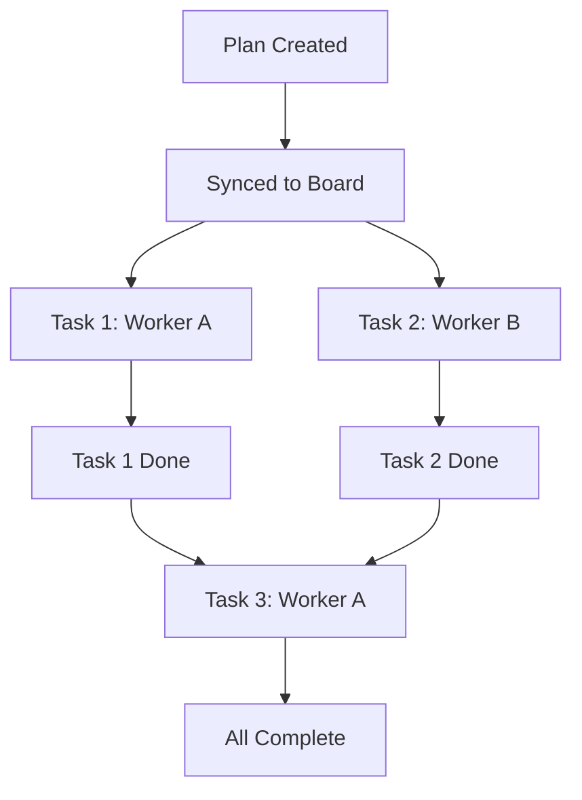

# Execution Log Visuals

This document provides templates and examples for visualizing task execution logs using Mermaid diagrams and status lists.

## 1. Task Execution Log Template

Use this format in `task_logs.md` or as part of the `## Execution Log` section in parent tasks.

### Execution Flow Example

### Status List Example

- **Task 1**: ✅ Done
- **Task 2**: ✅ Done
- **Task 3**: 🔄 In Progress

## 2. Usage Guidelines

- **Baseline**: Use the **Dependency Graph** from the plan as the baseline for the log's execution flow.
- **Updates**: Update the status icons (`✅`, `🔄`, `❌`, `todo`) as workers report progress.
- **Parallelization**: Clearly visualize which tasks are running in parallel vs. which are sequential.
