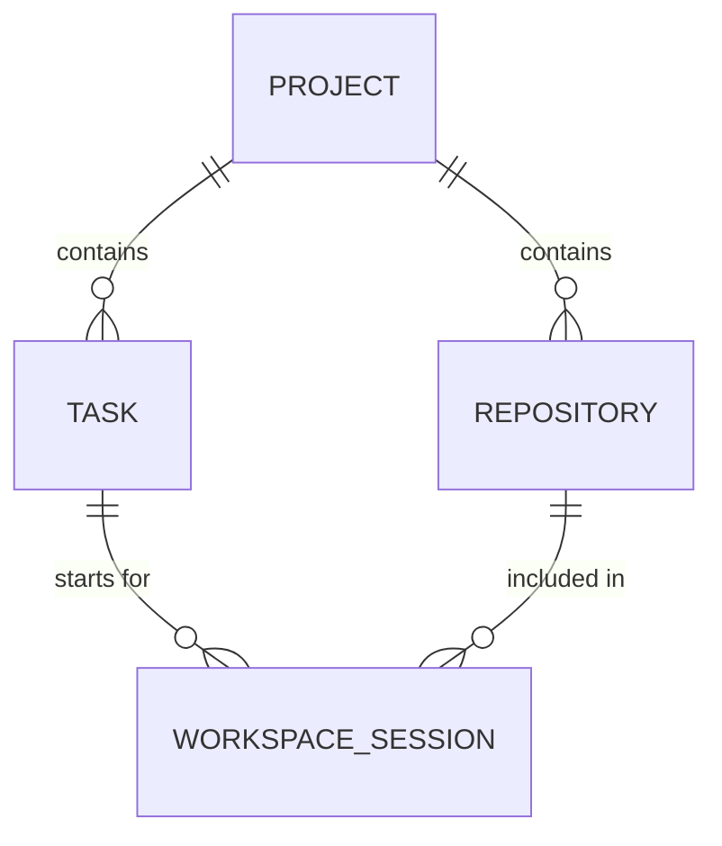

# Vibe Kanban Hierarchy

This document explains the relationship between the different entities in the Vibe Kanban system.

## Entities

### 1. Project

The top-level container. A project usually represents a specific product, service, or team initiative.

- **Identified by**: `project_id` (UUID).
- **Contains**: Multiple Repositories and Multiple Tasks.

### 2. Repository

A Git repository that is part of a Project.

- **Identified by**: `repo_id` (UUID).
- **Belongs to**: One Project.
- **Config**: Contains automation scripts (`setup`, `cleanup`, `dev_server`) that define how to work with this repo in a virtual workspace.

### 3. Task / Ticket

A specific unit of work (feature, bug, chore).

- **Identified by**: `task_id` (UUID).
- **Belongs to**: One Project.
- **Status**: `todo`, `inprogress`, `inreview`, `done`, `cancelled`.
- **Relationship**: A task can be worked on across multiple repositories in a single workspace session.

### 4. Workspace Session

A transient environment created to work on a specific Task.

- **Triggered by**: `start_workspace_session`.
- **Linked to**: One Task and one or more Repositories.
- **Executor**: The AI agent or environment used to perform the work (e.g., `CURSOR_AGENT`).

## Entity Relationship Diagram

## Workflow Summary

1. Find your **Project**.
2. Manage your **Tasks** within that project.
3. Use the **Repositories** in that project to launch a **Workspace Session** for a specific task.
