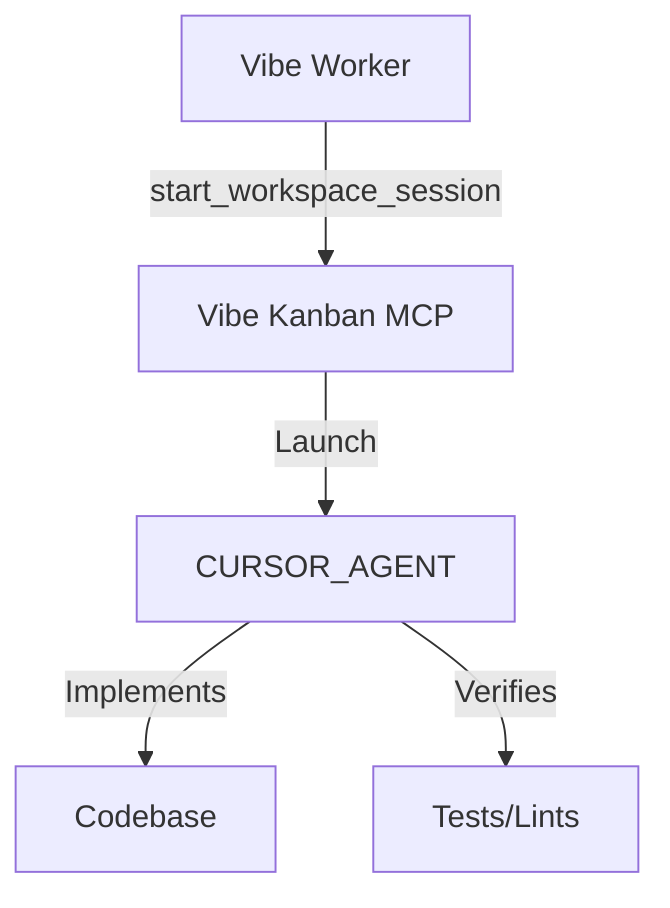

# 6. Use Cursor Agent as primary executor for Vibe Worker

Date: 2026-01-29

## Status

Accepted

## Context

The Vibe Kanban multi-agent system relies on `vibe-worker` subagents to perform implementation tasks. These workers operate within workspace sessions managed by the `vibe_kanban` MCP server. The server supports various executors (e.g., `CLAUDE_CODE`, `GEMINI`, `CURSOR_AGENT`, `CODEX`), each with different strengths.

Previously, the `vibe-worker` instructions were generic regarding which executor to use. However, for implementation tasks within the Cursor IDE, `CURSOR_AGENT` (Cursor CLI (auto)) provides the best integration for making code changes, running local tests, and providing feedback within the IDE environment.

## Decision

We will use `CURSOR_AGENT` as the primary and default executor for `vibe-worker` subagents.

The `vibe-worker` system prompt has been updated to explicitly call `start_workspace_session` with `executor: 'CURSOR_AGENT'`.

## Consequences

- **Improved IDE Integration**: Workers leverage Cursor's native agentic capabilities for implementation.
- **Consistency**: Standardizes the implementation environment across all worker tasks.
- **Traceability**: Decisions and edits made by the worker are more easily visible within the Cursor UI.
- **Constraint**: Workers are now coupled to the Cursor environment for implementation. Other executors can still be used if explicitly requested by the orchestrator, but the default is now opinionated.
