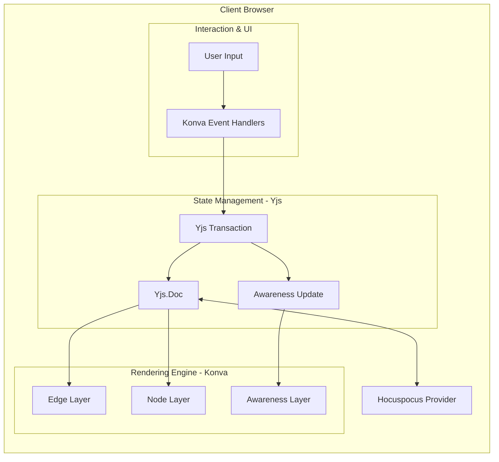

# 11. VibeCanvas scaffold three-layer Konva and Hocuspocus provider

Date: 2026-01-30

## Status

Accepted

## Context

The current VibeCanvas implementation uses a monolithic rendering approach where all canvas elements (nodes, edges, and awareness indicators) are rendered on a single Konva layer. Additionally, the synchronization layer uses `y-websocket` directly instead of the Hocuspocus provider specified in the system design.

According to `docs/spec/system_design.md`, the architecture should follow a three-layer Konva structure:

1. **EdgeLayer**: Renders connection lines between nodes (bottom layer)
2. **NodeLayer**: Renders nodes (rectangles, circles, etc.) (middle layer)
3. **AwarenessLayer**: Renders remote cursors and selection highlights (top layer)

The system design also specifies using `@hocuspocus/provider` for synchronization, which provides better awareness management and persistence hooks compared to raw `y-websocket`.

The current implementation has:

- Single-layer rendering in `App.vue` that mixes all canvas elements
- `WebsocketProvider` from `y-websocket` instead of `HocuspocusProvider`
- No explicit awareness state management for remote cursors and selections
- Limited separation of concerns between rendering and state management

## Decision

We will refactor the VibeCanvas scaffold to align with the system design specification:

### 1. Three-Layer Konva Architecture

Refactor `packages/frontend/src/App.vue` to implement three distinct Konva layers:

- **EdgeLayer**: Bottom layer for rendering edges/connections
- **NodeLayer**: Middle layer for rendering graph nodes
- **AwarenessLayer**: Top layer for rendering remote cursors, selections, and presence indicators

Each layer will have its own reactive watcher that responds to Yjs state changes and uses `batchDraw()` for efficient rendering.

### 2. Hocuspocus Provider Migration

Migrate `packages/frontend/src/composables/useGraphState.ts` from `WebsocketProvider` (y-websocket) to `HocuspocusProvider` (@hocuspocus/provider).

This includes:

- Replacing `WebsocketProvider` with `HocuspocusProvider`
- Implementing awareness state management for remote cursors and selections
- Exposing awareness state through the composable API

### Architecture Diagram

## Consequences

**Positive:**

- **Architectural Alignment**: The implementation now matches the system design specification, making it easier for developers to understand and extend
- **Performance**: Layer separation enables independent caching and selective redraws (e.g., edges can be cached while nodes update)
- **Maintainability**: Clear separation of concerns makes it easier to modify rendering logic for specific element types
- **Awareness Support**: Hocuspocus provider provides better awareness management for multi-user collaboration features
- **Scalability**: Three-layer architecture supports future features like layer-specific filters, animations, or visibility toggles

**Challenges:**

- **Initial Complexity**: More layers require careful z-index management and layer ordering
- **State Synchronization**: Need to ensure awareness state updates correctly trigger AwarenessLayer redraws
- **Migration Effort**: Requires refactoring existing rendering logic and testing collaboration features
- **Provider Compatibility**: Must ensure Hocuspocus server is running and compatible with the provider version

**Mitigation:**

- Start with a minimal scaffold that demonstrates the three-layer structure without full feature implementation
- Use TypeScript types to ensure layer references are correct
- Implement comprehensive tests for multi-user collaboration scenarios
- Document layer ordering and z-index conventions
- Create composables for each layer to encapsulate rendering logic
