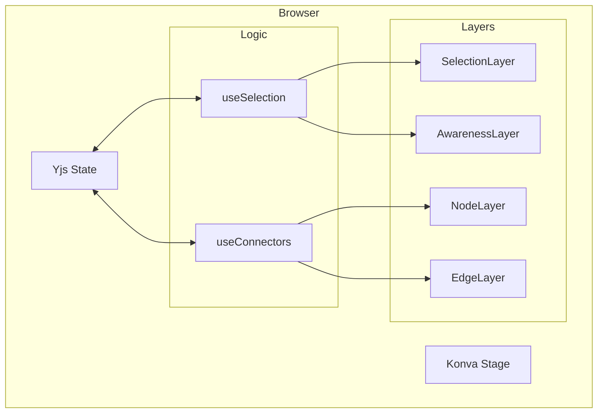

# 13. Semantic Graph and Interaction Model

Date: 2026-01-30

## Status

Accepted

## Context

The current VibeCanvas implementation is a basic whiteboard where nodes are simple rectangles and edges connect their geometric centers. This lacks the "Semantic" quality defined in the product vision, which requires:

1.  **Structured Connectivity**: Edges should attach to specific points (anchors) on node boundaries and remain attached during movement.
2.  **Collaborative Multi-select**: Users need to be able to select multiple objects via a marquee and see other users' selections in real-time.
3.  **High-Performance Rendering**: Maintaining 60fps while recalculating many edges and rendering remote awareness state.

## Decision

We will implement a reactive semantic graph layer using the following patterns:

### 1. Enhanced Data Schema

- **Nodes**: Add `anchorPoints` metadata (top, right, bottom, left) to `NodeData`.
- **Edges**: Add `sourceAnchor` and `targetAnchor` to `EdgeData`.
- **Selection**: Track `selectedNodeIds` in Yjs Awareness to broadcast collaborative selection state.

### 2. Interaction Layer Architecture

We will introduce a new `SelectionLayer` in Konva, positioned between `NodeLayer` and `AwarenessLayer`.

- **Marquee Selection**: A dedicated composable `useSelection.ts` will handle stage-level mouse events to draw a selection rectangle and perform hit-testing using Konva's `getClientRect()`.
- **Awareness Sync**: Local selection changes will be throttled and synced to Yjs Awareness.

### 3. Reactive Connectivity (Smart Connectors)

A `useConnectors.ts` composable will handle the calculation of edge points.

- **Anchor Math**: Instead of using node centers, edges will calculate their start/end points based on the nearest anchor or the intersection point with the node's boundary.
- **Dependency Tracking**: We will maintain a `nodeToEdges` mapping for efficient O(1) lookups during node movement.

### 4. Visualization (Mermaid)

## Consequences

- **Easier**: AI agents will be able to understand the graph structure (who is connected to whom and why) via the semantic metadata.
- **Easier**: Complex diagramming becomes professional with edges that don't overlap node content.
- **Difficult**: Edge routing math becomes more complex than simple center-to-center lines.
- **Risk**: High frequency Yjs updates during marquee selection could saturate the WebSocket if not throttled.
