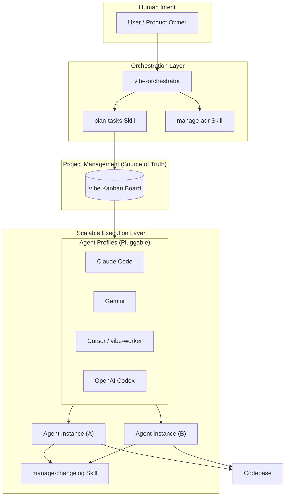

```mermaid
graph TB
    subgraph humanIntent ["Human Intent"]
        User["User / Product Owner"]
    end

    subgraph orchestrationLayer ["Orchestration Layer"]
        Orchestrator["vibe-orchestrator"]
        PlanSkill["plan-tasks Skill"]
        ADRSkill["manage-adr Skill"]
    end

    subgraph projectManagement ["Project Management (Source of Truth)"]
        Board[("Vibe Kanban Board")]
    end

    subgraph executionLayer ["Scalable Execution Layer"]
        subgraph agentProfiles ["Agent Profiles (Pluggable)"]
            Claude["Claude Code"]
            Gemini["Gemini"]
            Cursor["Cursor / vibe-worker"]
            Codex["OpenAI Codex"]
        end
        Worker1["Agent Instance (A)"]
        Worker2["Agent Instance (B)"]
        LogSkill["manage-changelog Skill"]
    end

    User --> Orchestrator
    Orchestrator --> PlanSkill
    Orchestrator --> ADRSkill
    PlanSkill --> Board
    Board --> agentProfiles
    agentProfiles --> Worker1
    agentProfiles --> Worker2
    Worker1 --> Code["Codebase"]
    Worker2 --> Code
    Worker1 --> LogSkill
    Worker2 --> LogSkill
```
