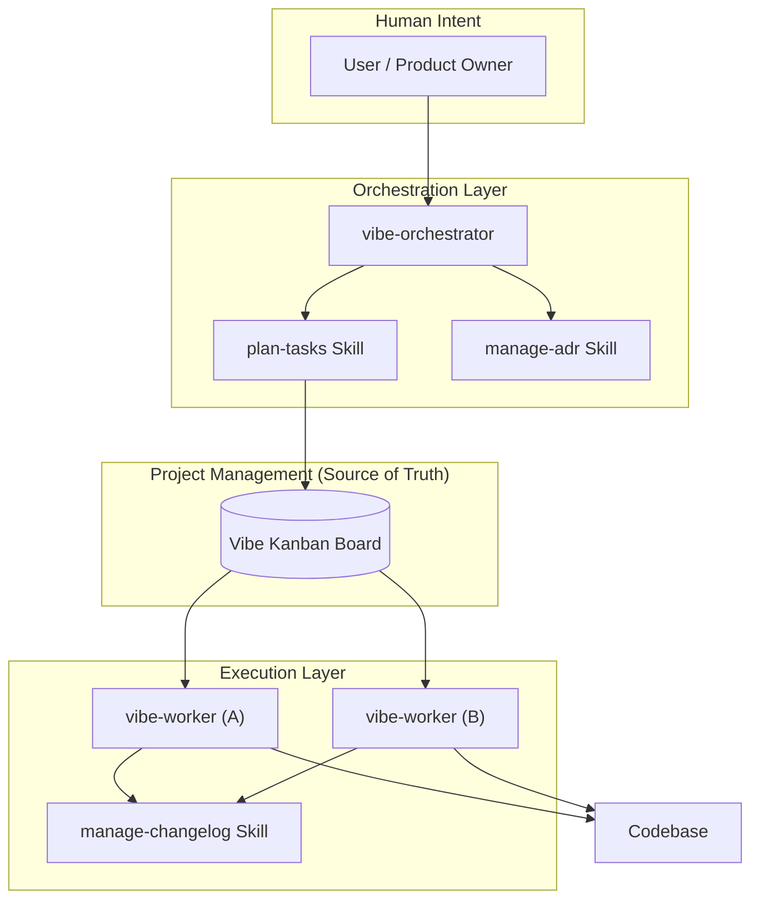

```mermaid
graph TB
    subgraph humanIntent ["Human Intent"]
        User["User / Product Owner"]
    end

    subgraph orchestrationLayer ["Orchestration Layer"]
        Orchestrator["vibe-orchestrator"]
        PlanSkill["plan-tasks Skill"]
        ADRSkill["manage-adr Skill"]
    end

    subgraph projectManagement ["Project Management (Source of Truth)"]
        Board[("Vibe Kanban Board")]
    end

    subgraph executionLayer ["Execution Layer"]
        Worker1["vibe-worker (A)"]
        Worker2["vibe-worker (B)"]
        LogSkill["manage-changelog Skill"]
    end

    User --> Orchestrator
    Orchestrator --> PlanSkill
    Orchestrator --> ADRSkill
    PlanSkill --> Board
    Board --> Worker1
    Board --> Worker2
    Worker1 --> Code["Codebase"]
    Worker2 --> Code
    Worker1 --> LogSkill
    Worker2 --> LogSkill
```
