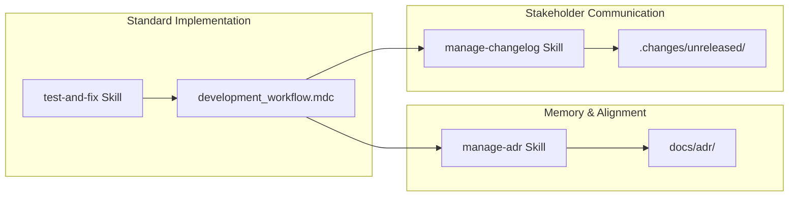

```mermaid
graph LR
    subgraph memory ["Memory & Alignment"]
        ADR["manage-adr Skill"]
        Docs["docs/adr/"]
    end

    subgraph implementation ["Standard Implementation"]
        Workflow["development_workflow.mdc"]
        Tests["test-and-fix Skill"]
    end

    subgraph communication ["Stakeholder Communication"]
        Changie["manage-changelog Skill"]
        Fragments[".changes/unreleased/"]
    end

    ADR --> Docs
    Workflow --> ADR
    Workflow --> Changie
    Changie --> Fragments
    Tests --> Workflow
```
