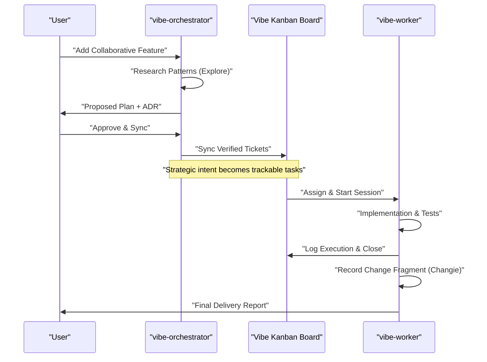

```mermaid
sequenceDiagram
    participant User as "User"
    participant Orchestrator as "vibe-orchestrator"
    participant Kanban as "Vibe Kanban Board"
    participant Worker as "vibe-worker"

    User->>Orchestrator: "Add Collaborative Feature"
    Orchestrator->>Orchestrator: "Research Patterns (Explore)"
    Orchestrator->>User: "Proposed Plan + ADR"
    User->>Orchestrator: "Approve & Sync"
    Orchestrator->>Kanban: "Sync Verified Tickets"
    Note over Orchestrator,Kanban: "Strategic intent becomes trackable tasks"
    Kanban->>Worker: "Assign & Start Session"
    Worker->>Worker: "Implementation & Tests"
    Worker->>Kanban: "Log Execution & Close"
    Worker->>Worker: "Record Change Fragment (Changie)"
    Worker->>User: "Final Delivery Report"
```
