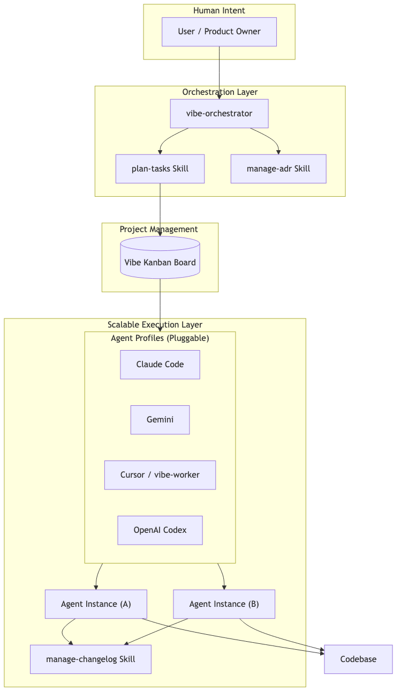
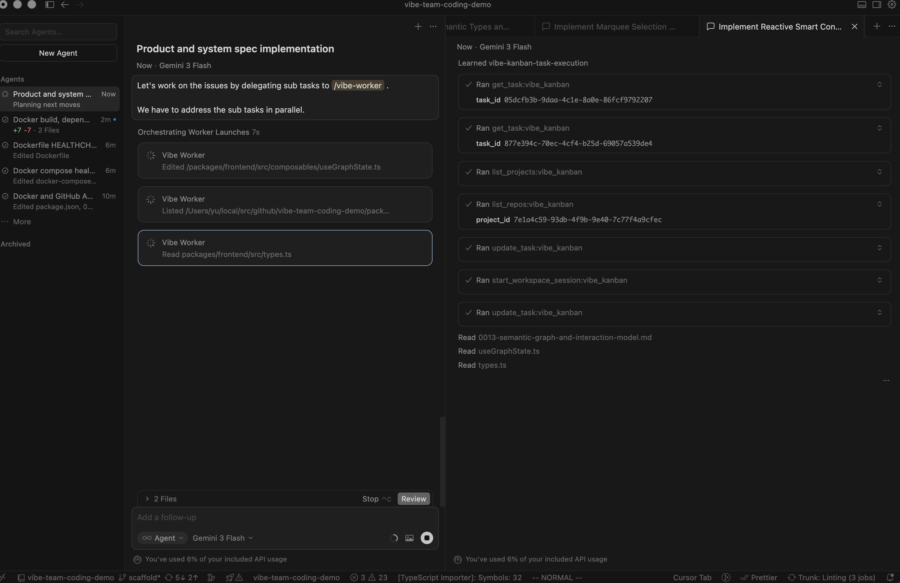
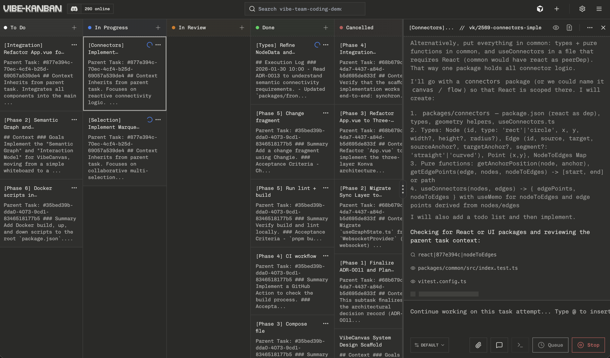
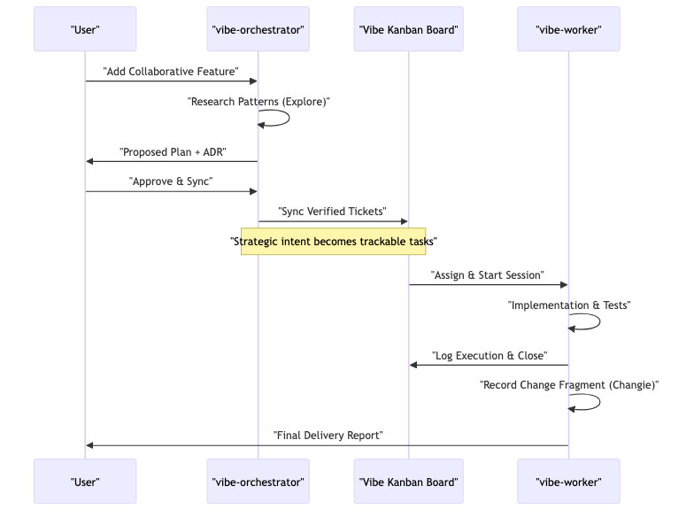
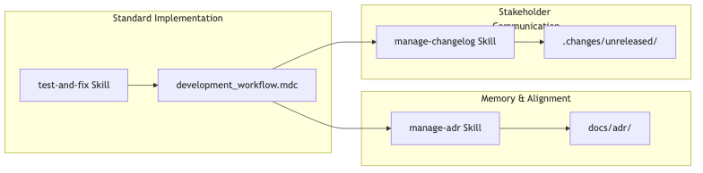

# Beyond the Prompt: Scaling AI Engineering with Multi-Agent Orchestration

**How we use Vibe Kanban, ADRs, and specialized subagents to build production-grade software without the "AI debt."**

---

## The "Lone Wolf" Problem: Why Solo AI Agents Fail at Scale

Most AI coding demonstrations follow a familiar pattern: a developer sends a complex prompt to a single LLM, and the LLM spits out a few hundred lines of code. It looks like magic—until you try to scale it.

In real-world engineering, this "Lone Wolf" or "cowboy coding" approach leads to three major failures that every software team fears:

1. **Architectural Drift**: Without a global view, the AI makes local decisions that clash with the overall system design. This is the AI equivalent of "spaghetti code."
2. **Context Collapse & Documentation Debt**: As the codebase grows, the agent—and the human—loses track of the "why" behind previous changes. This increases the "Bus Factor"—if the person who wrote the prompt leaves, the knowledge is gone.
3. **Visibility Blackout**: Stakeholders have no idea what the AI is actually doing until the Pull Request arrives. If the AI misunderstood the requirement, you've wasted hours of execution time.

To solve this, we've moved beyond the solo agent. We've built an **AI Swarm**—a hierarchical multi-agent system governed by professional engineering hygiene. This isn't just about writing code; it's about **Scalable Project Management**.

---

## 1. The Command & Control Hierarchy: Orchestration vs. Execution

The foundation of our approach is the "Plan more, review less" mantra. By spending five minutes on a high-level strategy, we save hours of correction later. We divide AI labor into two distinct roles: **Strategic Orchestration** and **Tactical Execution**.

### The vibe-orchestrator (Strategic)

The Orchestrator is the "brain" and the guardian of the project's soul. It doesn't write implementation code. Instead, it:

- **Researches existing patterns** using specialized `explore` tools to ensure every new feature feels like it belongs.
- **Drafts Architectural Decision Records (ADRs)** to document the rationale for technical choices.
- **Populates the Board via MCP**: Using the **Vibe Kanban MCP Server**, the Orchestrator programmatically creates a hierarchy of tasks and subtasks on the board. It practices **Granular Decomposition**, splitting monolithic requirements into independent, trackable units of work that can be addressed by separate agents.

### The vibe-worker (Tactical)

The Worker is the "hands." It picks up atomic tickets from the Kanban board.

- **Isolation via Git Worktrees**: Every task attempt runs in its own ephemeral **Git Worktree**. This isolated environment prevents "collisions" between agents, allowing 10+ workers to work on the same repository in parallel without interference.
- **Automated Hygiene (Setup/Cleanup)**: Before a worker starts, **Setup Scripts** (e.g., `npm install`) prepare the environment. When it finishes, **Cleanup Scripts** (e.g., `npm run lint`) ensure the workspace is pristine.
- **Real-time Feedback**: It reports progress back to the Kanban board, making its work observable line-by-line.

As seen in the screenshot above, the planning phase is orchestrated directly within Cursor. The `vibe-orchestrator` analyzes the requirements, explores the codebase, and proposes a comprehensive execution plan. This strategic alignment ensures that the "What" and "Why" are verified by the human developer before any implementation begins.

---

## 2. The Neural Link: Vibe Kanban & Interactive Verification

Once the plan is verified and synced via the MCP Server, it populates the Vibe Kanban board with atomic, parallelizable tasks. The screenshot illustrates this transition from high-level intent to a swarm of active implementations. Multiple `vibe-worker` agents then pick up these tickets in parallel, significantly accelerating the development cycle while maintaining strict architectural boundaries.

The secret to scaling isn't just better prompts; it's **Task Management** and **Precise Feedback**. By using a Vibe Kanban board as the "Source of Truth," we achieve 100% observability.

### Plan-First, Code-Second

In our workflow, the Orchestrator must create a verified plan—often using specialized **Plan Mode** variants—before a single ticket is moved to "In Progress." If an approach fails, the agent can **Re-plan**, providing a summarized fresh start with better context rather than patching a broken solution.

### Granular Decomposition: Solving Big Problems via Small Swarms

One of the biggest bottlenecks in AI engineering is the "context window" and the reasoning limit of single models. When a task is too large, the AI's logic begins to fray. Our solution is **Granular Decomposition**.

The Orchestrator's most critical job is to identify independent logic blocks and split a monolithic requirement into bite-sized sub-tasks. By doing this:

- **Focused Reasoning**: Each sub-agent works on a specific, isolated problem, drastically reducing the chance of logic errors.
- **Parallel Velocity**: Because tasks are independent, we can launch multiple `vibe-worker` agents simultaneously. A feature that would take 4 hours for a single agent is completed in 30 minutes by a swarm of eight.
- **Scalability**: This "Divide and Conquer" strategy allows us to tackle complex systems that would be impossible for a single LLM to hold in memory.

### A Pluggable Agent Ecosystem: Choice Without Compromise

One of the most powerful features of Vibe Kanban is its **agent-agnostic nature**. While we use `vibe-worker` for its deep integration, the system is designed as a pluggable ecosystem.

Through **Agent Profiles**, developers can swap the underlying "brain" of their workers. Whether you prefer the raw reasoning of **Claude Code**, the speed of **Gemini**, the familiarity of **Cursor**, or the versatility of **OpenAI Codex**, Vibe Kanban orchestrates them all through the same unified board.

This means your workflow is future-proof. As new, more capable models and coding agents emerge, you can simply plug them into your existing Kanban-driven orchestration without changing your engineering processes.

For more details on supported agents and how to configure them, check out the [Vibe Kanban Documentation](https://www.vibekanban.com/docs/supported-coding-agents).

### Interactive Feedback & Preview

We've eliminated the "can you try this?" guesswork with the **Embedded Preview Browser**.

- **Component Selection**: Instead of describing "the button in the top right," developers can use the Web Companion to select UI components directly. The agent receives the precise DOM selector and source file location, making UI iterations deterministic.
- **Action Approvals**: Even in autonomous "YOLO" modes, critical actions can require human approval, maintaining control without sacrificing speed.

---

## 3. Engineering Hygiene as Code: Capturing Architectural Memory

AI agents are only as good as the guardrails we give them. We use specialized Agent Skills and **Task Tags (@mentions)** to ensure our AI-generated codebase remains maintainable for years.

### Capturing "Architectural Memory" with ADRs

Every significant choice—like choosing a database or a state management pattern—is documented using the `manage-adr` skill. This prevents the "AI amnesia" where future agents (or humans) might accidentally reverse a critical decision.

### Automated Stakeholder Communication (Changelogs)

We don't rely on git history alone, which can be messy. The `manage-changelog` skill (powered by Changie) requires agents to record "change fragments" for every completed task. This turns technical "noise" into readable, stakeholder-ready release notes automatically. It bridges the gap between the technical "how" and the business "what."

### Standardized Execution with Task Tags

By using global **Task Tags (@mentions)**, we can quickly insert shared engineering standards—like Acceptance Criteria or Review Checklists—into any task description, ensuring every agent follows the same professional standards.

---

## The Future: From "Writer of Lines" to "Director of Intent"

The goal of AI engineering isn't to replace the developer; it's to replace the **drudgery**. By orchestrating specialized subagents through a structured workflow, we transform AI from a simple "coding assistant" into a full-fledged **Production Partner**.

In this ecosystem, the role of the human developer is evolving. You are no longer just a "writer of lines" who gets bogged down in syntax and boilerplate. You are becoming a **Director of Intent**—an architect who defines the vision, verifies the outcomes, and steers the swarm.

---

*Want to see the workflow in action? Check out our [GitHub repository](https://github.com/vibe-team-coding-demo) and explore our `.cursor/rules` to see how we define these agentic behaviors.*
