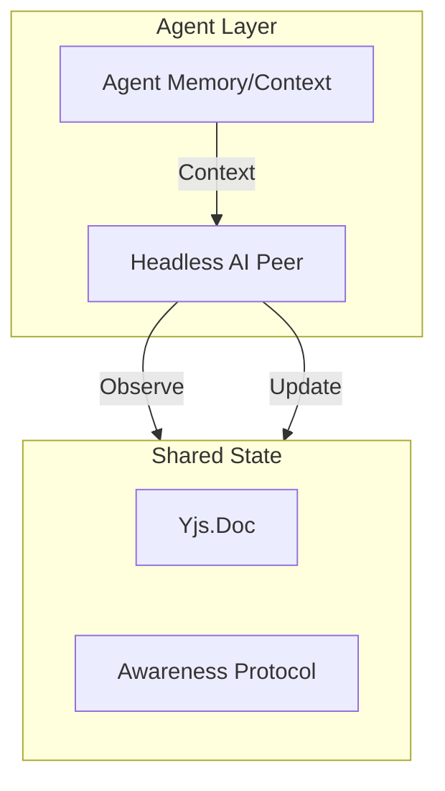

# Agent Design: VibeCanvas Agent Layer

The Agent Layer in VibeCanvas is a first-class citizen of the collaborative environment. Agents are designed as **Headless AI Peers** that interact with the same shared state as human collaborators.

## 1. Architectural Role

Agents in VibeCanvas are not just chatbots; they are active participants in the spatial graph. They operate by:

- **Reading**: Observing the Yjs CRDT state (nodes, edges, awareness).
- **Reasoning**: Processing spatial and semantic data using LLMs.
- **Writing**: Emitting Yjs transactions to modify the graph or add metadata.

## 2. Agent Memory & Context Inheritance

To ensure agents operate with consistent architectural understanding, VibeCanvas utilizes a **Distributed Agent Memory** system based on context inheritance.

### Context Inheritance Principles

Agents inherit context from task hierarchies to maintain a "why" (rationale) behind their "what" (instructions).

1. **Parent Tasks Store Context**: High-level goals, architectural decisions (ADRs), and constraints are stored in parent tasks.
2. **Subtasks Inherit Context**: Subtasks reference or summarize parent context relevant to their specific scope.
3. **Context Aggregation**: Agents combine parent context + specific subtask plans + related tasks to build a full mental model.

### Implementation Patterns

- **Selective Inheritance**: Agents extract only relevant performance or integration constraints from parent documents.
- **Context Extension**: When an agent discovers a new constraint (e.g., a library limitation), it updates the parent memory to propagate this knowledge to other agents.

## 3. Interaction Patterns

### Human-Agent Collaboration

- **Awareness Participation**: Agents emit remote cursor positions and selection highlights, making their actions visible and predictable to humans.
- **Semantic Tagging**: Agents can "read" rough human sketches and add semantic tags or properties (e.g., converting a circle into a `Service` node).

### Agent-Agent Collaboration

- **Orchestration**: The `vibe-orchestrator` agent plans high-level milestones and delegates implementation to `vibe-worker` agents.
- **Shared Knowledge**: By using a shared CRDT state, agents avoid "last-write-wins" conflicts, even when multiple agents are refactoring different parts of the same graph.

## 4. Skills & Tooling

Agents leverage the project's **Cursor Skills** (`.cursor/skills/`) as their operational toolbox:

- **Vibe Management**: Tools for handling task hierarchies and context inheritance.
- **Vibe Execution**: Tools for interacting with the workspace (Shell, Git, Gh).
- **Manage ADR**: Tools for recording and reading architectural decisions.

## 5. References

- See `[.cursor/skills/vibe-kanban-management/references/context-inheritance.md](../../.cursor/skills/vibe-kanban-management/references/context-inheritance.md)` for technical details on inheritance.
- See `[system_design.md](system_design.md)` for the global architecture.
