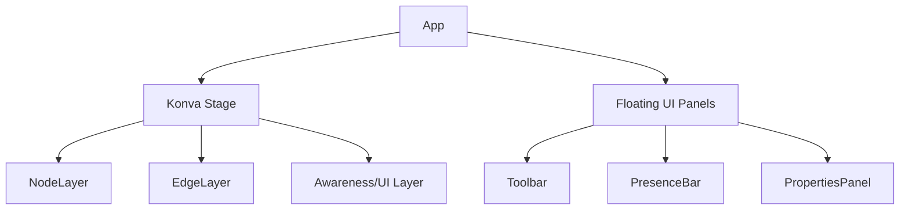

# Product Design: VibeCanvas

VibeCanvas is a spatial, object-oriented whiteboard designed for high-performance collaboration and AI readiness.

## User Interface Layout

The VibeCanvas UI is designed to be "Canvas-First," maximizing the workspace while providing accessible tools through collapsible and overlay panels.

### 1. The Main Canvas (`Canvas`)

- **Infinite Workspace**: A WebGL-accelerated area (Konva.js) for spatial organization.
- **Viewport Controls**: Support for zooming (scroll wheel) and panning (middle mouse or space+drag).

### 2. The Global Toolbar (`Toolbar`)

- **Location**: Floating top-center or fixed top-left.
- **Tools**: Select, Pan, Sticky Note, Rectangle, Circle, Line/Connector, Text, Eraser.

### 3. Presence Bar (`PresenceBar`)

- **Location**: Top-right corner.
- **Functionality**: Displays active collaborators (avatars), sync status (connected/offline), and share settings.

### 4. Properties Panel (`PropertiesPanel`)

- **Location**: Floating right side (collapsible).
- **Functionality**: Contextual settings for the selected object (e.g., color, font size, border-style, semantic tags).

## Interaction Model

### Selection & Manipulation

- **Single Click**: Selects an object and reveals its properties.
- **Click & Drag**: Moves the selected object(s).
- **Multi-Select**: Click and drag on the canvas background to create a selection marquee.
- **Resize Handles**: Visible on selection, allowing scaling of shapes.

### Connectors & Relationships

- **Connection Handles**: Small nodes appearing on the edges of shapes when hovered or selected.
- **Semantic Linkage**: Dragging from a handle to another object creates a persistent `Edge` that tracks the movement of both connected objects.

### Collaborative Awareness

- **Remote Cursors**: Real-time display of other users' cursor positions with name labels.
- **Selection Highlights**: Visual indication (colored borders) when an object is being edited or selected by another user.

## Component Hierarchy (Frontend)

