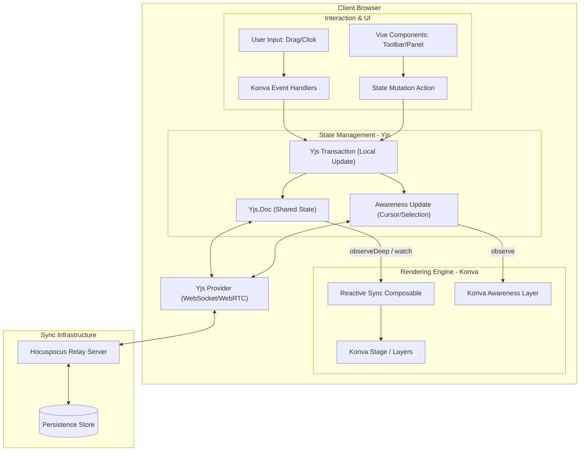

# VibeCanvas System Design

VibeCanvas is a collaborative spatial graph editor designed for high-performance, real-time interaction on an infinite canvas.

## Architecture Overview

VibeCanvas follows a local-first architecture using CRDTs (Conflict-free Replicated Data Types) for state synchronization and HTML5 Canvas (via Konva.js) for high-performance rendering.

### Detailed Component Interaction

## Data Model (Yjs Shared State)

The application state is managed as a single Yjs Document containing shared maps for nodes and edges.

### Shared Types

- `yNodes`: `Y.Map<string, Y.Map<string, any>>`
  - Key: Node ID (UUID)
  - Value: A `Y.Map` containing node properties:
    - `id`: string
    - `type`: string (e.g., 'rectangle', 'circle')
    - `x`: number
    - `y`: number
    - `width`: number
    - `height`: number
    - `content`: string
    - `color`: string

- `yEdges`: `Y.Map<string, Y.Map<string, any>>`
  - Key: Edge ID (UUID)
  - Value: A `Y.Map` containing edge properties:
    - `id`: string
    - `sourceId`: string (ID of the source node)
    - `targetId`: string (ID of the target node)
    - `type`: string (e.g., 'straight', 'curved')

## State Synchronization & Awareness

### Awareness Protocol

The Awareness layer handles transient state that does not need to be persisted:

- **Remote Cursors**: Current mouse coordinates $(x, y)$ of each user.
- **Selections**: IDs of nodes/edges currently selected by a user.
- **Presence**: User metadata (name, color, avatar).

### Data Flow

#### 1. Event-to-Transaction (Write Path)

1. **User Interaction**: User drags a node on the Konva canvas.
2. **Local Feedback**: Konva updates the shape position instantly for zero-latency feedback.
3. **Transaction**: The interaction triggers a Yjs transaction that updates the `yNodes` map.
4. **Sync**: Yjs calculates the diff and the Provider transmits it to the Relay server.

#### 2. Transaction-to-Render (Read Path)

1. **Update Received**: The Relay server broadcasts the update to other clients.
2. **Merge**: Local Yjs document merges the update conflict-free.
3. **Reactive Trigger**: The `useGraphState` composable (or Vue `watch`) detects the change in the shared map.
4. **Batch Draw**: Konva objects are updated to match the new Yjs state, and `stage.batchDraw()` is called to re-render the canvas.

## Rendering Architecture (Konva.js)

Konva.js is used to render the spatial graph. The rendering loop is reactive to Yjs state changes.

- **Stage**: The root container for the canvas.
- **Layers**:
  - `EdgeLayer`: Renders connection lines between nodes.
  - `NodeLayer`: Renders nodes (rectangles, circles, etc.).
  - `AwarenessLayer`: Renders remote cursors and selection highlights.
- **Performance**:
  - **Layer Caching**: Static or slow-moving layers are cached as bitmaps.
  - **Batching**: All Yjs updates within a single tick are batched into one `batchDraw()` call.

## Agent Layer Integration

VibeCanvas is designed to support AI agents as first-class collaborators. See `[agent_design.md](agent_design.md)` for details on agent memory, context inheritance, and interaction patterns.
